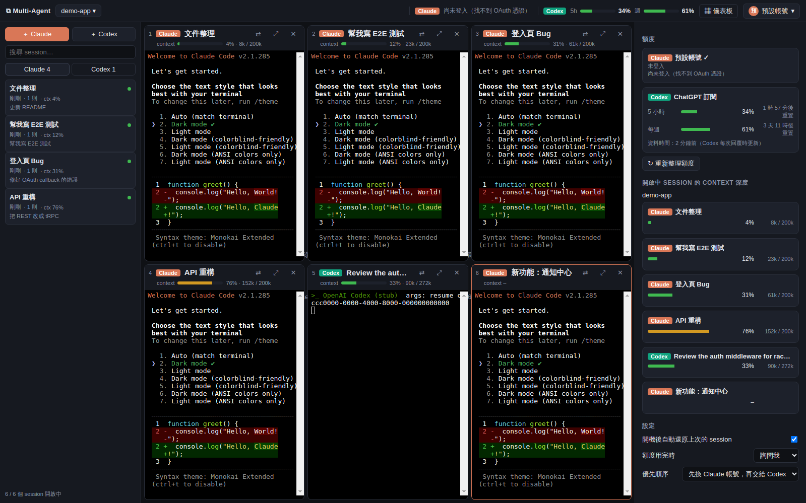
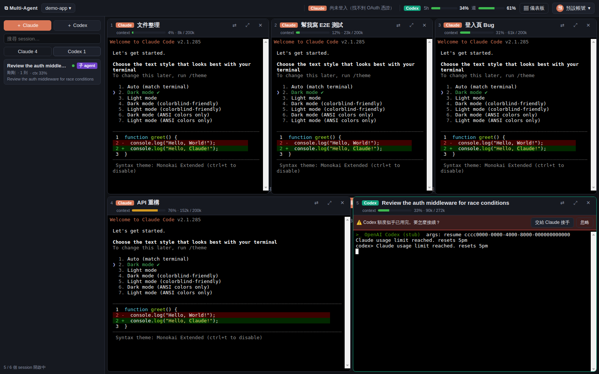

# Multi-Agent CLI

一個桌面視窗，集中管理同一個專案底下的所有 **Claude Code** 與 **Codex** session：

- 進到專案就看到該目錄的 **所有 session 歷史**（Claude + Codex），點一下就開
- 最多 **6 個 session 並排**，版面依視窗比例自動調整、永遠填滿（最後一列不滿時自動加寬，不留空格）；每個窗格都是真正的終端機，可以直接對話、看輸出
- 每個窗格上方清楚顯示 **session 名稱**（可雙擊改名）、Claude / Codex 標籤、使用的帳號
- **儀表板**：Claude 各帳號的 5 小時 / 每週額度、Codex 的 5 小時 / 每週額度、每個 session 的 **context 深度**
- **開機即還原**：重開程式自動 `--resume` 上次開著的所有 session，不用再開一堆終端機
- **帳號切換**：多個 Claude 帳號（各自的 `CLAUDE_CONFIG_DIR`），共用 session 歷史
- **Codex 整合**：一鍵把 Codex 裝成 Claude 的 MCP 子 agent；額度用完時自動換帳號續跑或交給 Codex 接手





> 截圖是在測試環境中用假資料與 stub CLI 拍的。

## 安裝與啟動

需求：Node.js 20+、已安裝並可在終端機執行的 `claude`（Claude Code），想用 Codex 的話另外需要 `codex`（Codex CLI）。

```bash
git clone https://github.com/Nelson0314/Multi_Agnet_CLI.git
cd Multi_Agnet_CLI
npm install     # 會自動處理 node-pty 原生模組（macOS / Windows 直接使用 prebuild）
npm start
```

之後要更新到最新版：

```bash
cd Multi_Agnet_CLI
git pull
npm install
npm start
```

平台注意事項：

- **macOS / Windows**：不需要安裝編譯工具，`npm install` 完就能跑。
- **Linux**：需要能編譯原生模組（`sudo apt install build-essential python3`），`npm install` 會自動編譯 node-pty。
- 啟動前先確認在一般終端機裡打 `claude`（以及 `codex`）可以正常執行並已登入；本程式會透過你的 login shell 找這兩個指令。

想要開機就自動開啟：在右側「儀表板 → 設定」勾選「登入電腦時自動開啟本程式」（macOS / Windows）。

## 使用方式

| 動作 | 怎麼做 |
| --- | --- |
| 切換 / 開啟專案 | 左上角專案按鈕，或「開啟其他資料夾…」 |
| 開啟舊 session | 左側清單點一下（已開啟的會有綠點，點了會聚焦到該窗格） |
| 新 session | 「＋ Claude」/「＋ Codex」，可先輸入名稱 |
| 改名 | 雙擊窗格標題，或在清單上按右鍵 |
| 最大化單一窗格 | 窗格右上 ⤢ |
| 聚焦第 N 個窗格 | `Ctrl/⌘ + 1…6` |
| 複製 / 貼上 | macOS：`⌘C` / `⌘V`；Windows / Linux：`Ctrl+Shift+C` / `Ctrl+Shift+V`（`Ctrl+V` 保留給 Claude Code 貼圖片） |
| 換帳號續跑、交給 Codex / Claude | 窗格右上 ⇄ |
| 帳號登入、新增、切換 | 右上角帳號選單 |
| 看額度與 context | 右上「▦ 儀表板」，頂列也有精簡版額度條 |

關閉窗格只會結束該程式，session 紀錄仍在，隨時可以從清單再開。

## 帳號（Profile）

- **預設帳號**：就是你平常的 `~/.claude`。
- **新增帳號**：程式會建立一個新的 `CLAUDE_CONFIG_DIR`，並開一個小終端機跑 `claude auth login` 讓你登入。
- 預設勾選「共用 session 歷史」：新帳號的 `projects/`、`settings.json`、`CLAUDE.md`、`commands/`、`agents/`、`skills/` 會用 symlink（Windows 用 junction）指回 `~/.claude`。
  所以 **帳號 A 額度用完時，可以用帳號 B `claude --resume` 同一個 session，對話完全不中斷**。
- 可選擇讓某帳號使用獨立的 Codex 登入（`CODEX_HOME`）。
- 切換「目前帳號」只影響之後新開的 session；已開著的窗格可以從 ⇄ 選單個別換帳號。

請只加入你自己擁有、有權使用的帳號，並遵守各服務的使用條款。

## Claude × Codex 整合設計

完整設計與理由見 [docs/DESIGN.md](docs/DESIGN.md)。重點：

1. **Codex 當子 agent**：帳號選單 →「讓 Claude 可以呼叫 Codex」，會執行
   `claude mcp add --scope user codex -- codex mcp-server`。Claude 因此多了 `codex` / `codex-reply` 工具，可以多輪對話地指揮 Codex。
   被 Claude 叫出來的 Codex session 會出現在左側 Codex 分頁並標示「子 agent」，隨時可以點開來看它在做什麼，甚至直接接手。
2. **額度 fallback**（儀表板 → 設定可選「詢問我 / 自動接手 / 不處理」與優先順序）：
   1. 換另一個 Claude 帳號 `--resume` 同一個 session（零資訊損失）
   2. 交給 Codex：自動產生交接文件（目標、待辦、改過的檔案、git 狀態、最近對話），在同一格啟動 Codex 接手
   3. Claude 額度恢復後，同樣可以從 Codex 交回 Claude

## 資料從哪來

| 資料 | 來源 |
| --- | --- |
| Claude session 歷史、名稱、context | `~/.claude/projects/<編碼後路徑>/<sessionId>.jsonl`（名稱取 `/rename` → 自動標題 → 第一句話） |
| Codex session 歷史、context、額度 | `~/.codex/sessions/YYYY/MM/DD/rollout-*.jsonl` |
| Claude 5 小時 / 每週額度 | 與 Claude Code `/usage` 相同的 OAuth usage 端點（token 從 `.credentials.json` 或 macOS Keychain 讀取） |
| 帳號 email | `<config dir>/.claude.json` 的 `oauthAccount` |
| 本程式狀態（開著的窗格、自訂名稱、設定） | Electron `userData/state.json` |
| 交接文件 | 專案內 `.multi-agent/handoffs/`（自動加入 `.git/info/exclude`，不會出現在 git status） |

Context 深度 = 最後一次主線回覆的 `input + cache_creation + cache_read` tokens ÷ context window（預設 200k，超過或模型標示 1M 時視為 1M）。

## 已知限制

- Claude 額度用的 OAuth usage 端點不是公開文件化的 API，格式改變時儀表板會顯示「無法取得額度」，其他功能不受影響。
- macOS 第一次讀取 Keychain 時系統可能跳出授權視窗，選「永遠允許」即可。
- Token 過期時額度會暫時顯示不出來：在該帳號開任一個 session，Claude Code 就會自動更新 token。
- Codex 額度來自最近一次 Codex 回覆時寫入的紀錄，所以只有用過 Codex 之後才會更新。
- 額度用完的偵測靠比對終端機輸出與額度 API；CLI 文字改版時可能要更新 `src/main/ptyManager.js` 的 `LIMIT_PATTERNS`。

## 開發

```bash
npm test        # 單元測試（session 解析、Codex 額度、交接文件、額度訊息偵測…）
```

```
src/
  main/
    main.js            Electron 主程式、IPC
    claudeSessions.js  Claude session 列表、標題、context 深度
    codexSessions.js   Codex session 列表、context、5h/週 額度
    usage.js           Claude 5h/週 額度（OAuth usage 端點）
    profiles.js        多帳號（CLAUDE_CONFIG_DIR / CODEX_HOME）
    handoff.js         Claude ⇄ Codex 交接文件
    ptyManager.js      以 node-pty 執行 CLI、偵測額度用完
    store.js           狀態持久化
  preload.js           安全的 renderer API
  renderer/            介面（xterm.js）
```
