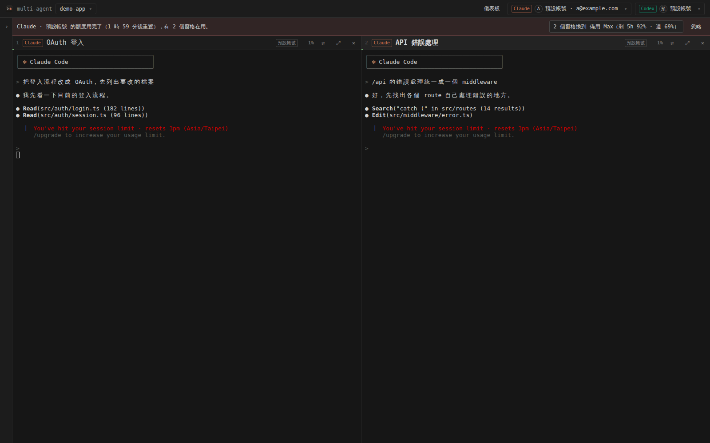

<p align="center"></p>

<h1 align="center">Multi-Agent CLI</h1>

<p align="center">繁體中文 · <a href="README.en.md">English</a></p>

同一個專案常常同時開好幾個 Claude Code session。每次開機都要開一堆終端機、`cd` 進去、再一個個 `--resume`。這個桌面程式把它們收進同一個視窗：左邊列出這個資料夾的所有 Claude 與 Codex session，點一下就在右邊開成終端機，最多 6 個並排，關掉程式再打開會原樣還原。


## 功能

- 依專案列出 session 歷史（Claude 與 Codex），可搜尋、改名、右鍵複製 id。
- 每個窗格是真正的終端機（node-pty + xterm.js），跑的就是你平常的 `claude` 和 `codex`。
- 最多 6 格。版面依視窗長寬比自動排，最後一列不滿時會加寬，不會留空格。
- 窗格上方顯示 session 名稱、Claude 或 Codex、使用的帳號，以及 context 用量（例如 `76% · 152k / 200k`）。
- 儀表板顯示每個 Claude 與 Codex 帳號的 5 小時、每週剩餘額度（依剩餘量變色：50% 以上綠、20–50% 黃、20% 以下紅），以及各窗格的 context。
- Claude 與 Codex 帳號分開登入、分開切換，兩個工具可以用不同的帳號。同一個工具的帳號共用 session 歷史，所以可以換帳號續跑同一個 session。
- 帳號額度用完時，用這個帳號的所有窗格一次換到另一個帳號：結束舊程式、用新帳號續跑同一個 session，不用在每個視窗打 `/login`。
- 五種主題（Terminal、Graphite、Sand、Mono、Paper），整個介面使用系統終端機的等寬字型。Claude 與 Codex 標籤用它們原本的品牌色。
- 英文與繁體中文介面，在儀表板的「外觀」切換。


## 安裝

需要 Node.js 22.12 以上，以及能在終端機執行並已登入的 `claude`。要用 Codex 的話另外需要 `codex`。

```bash
git clone https://github.com/Nelson0314/Multi_Agnet_CLI.git
cd Multi_Agnet_CLI
npm install
```

`npm install` 完成後，桌面會多一個 Multi-Agent CLI 捷徑：

| 系統 | 捷徑 |
| --- | --- |
| Windows | `桌面\Multi-Agent CLI.lnk` |
| macOS | `~/Desktop/Multi-Agent CLI.app` |
| Linux | `~/Desktop/multi-agent-cli.desktop`，也會加進應用程式選單 |

之後雙擊捷徑就能開。安裝時如果顯示「找不到桌面資料夾」而沒有建立捷徑，或是捷徑刪掉了，可以用 `npm run shortcut` 重建；不想要捷徑的話，安裝時設定 `MULTI_AGENT_NO_SHORTCUT=1`。也可以直接在專案資料夾執行 `npm start`。

更新：

```bash
cd Multi_Agnet_CLI
git pull
npm install
```

平台差異：

- macOS 與 Windows 使用 node-pty 內附的預編譯模組，不需要編譯工具。
- Linux 需要 `build-essential` 與 `python3`，`npm install` 會自動編譯 node-pty。
- 程式透過你的 login shell 找 `claude` 和 `codex`，所以用 nvm、Homebrew 或 npm 全域安裝的都找得到。

## 使用

| 動作 | 方式 |
| --- | --- |
| 開專案 | 左上角的專案按鈕 |
| 開舊 session | 點左側清單。已開的會聚焦到該窗格。`↻` 重新讀取 session 歷史 |
| 新 session | `+ Claude` 或 `+ Codex`，可以先取名 |
| 純終端機 | `+ PowerShell`（macOS、Linux 顯示為 `+ Shell`），在專案資料夾開一個一般的終端機。Windows 有裝 PowerShell 7 就用 `pwsh`，否則用內建的 Windows PowerShell。會跟著版面一起還原，也帶著目前的 Claude 與 Codex 帳號，所以在裡面打 `claude` 或 `codex` 會用這兩個帳號 |
| 改名 | 雙擊窗格標題，或在清單上按右鍵 |
| 最大化 | 窗格右上 `⤢` |
| 調整窗格大小 | 拖曳窗格之間的分隔線；直線調整左右、橫線調整上下，雙擊分隔線回到平均。大小依比例記錄，縮放視窗時照樣填滿，重開程式後沿用 |
| 切換窗格 | `Ctrl/⌘ + 1…6` |
| 側欄 | 預設收成一條細邊，只留一個 `›`；滑鼠移上去會浮出完整側欄。按 `‹` `›` 或 `Ctrl/⌘ + B` 固定展開或收起 |
| 複製、貼上 | macOS 用 `⌘C` `⌘V`；Windows、Linux 用 `Ctrl+Shift+C` `Ctrl+Shift+V`。`Ctrl+V` 留給 Claude Code 貼圖片 |
| 換帳號續跑、重新開啟 | 窗格右上 `⇄` |
| 登入、新增、切換帳號 | 右上角的 Claude、Codex 帳號選單 |
| 主題、字級、字型、語言 | 儀表板的「外觀」 |
| 窗格按鈕 | 滑鼠移到窗格上，或窗格是目前焦點時才會出現 |

關閉窗格只會結束程式，session 紀錄留在硬碟上，隨時可以從清單再開。

## 外觀

儀表板的「外觀」可以選主題、字級與終端機字型。字型預設跟系統終端機一樣：macOS 用 SF Mono 或 Menlo，Windows 用 Cascadia Mono 或 Consolas，Linux 用 DejaVu Sans Mono，中文也用等寬字：Windows 依序找更紗黑體 Sarasa Mono TC、Noto Sans Mono CJK TC、主控台用的細明體，macOS 用蘋方，Linux 用 Noto Sans Mono CJK TC。想指定別的字型，填在「終端機字型」。

主題只改介面的背景、文字和分隔線。窗格裡程式輸出的顏色完全照原樣顯示，16 色 ANSI 色盤沿用系統原生終端機：Windows 是 Windows Terminal 的 Campbell，macOS 是 Terminal.app，Linux 是 GNOME Terminal 的 Tango。

用 Paper 這種淺色主題時，在 Claude Code 裡執行 `/theme` 選 `Auto (match terminal)`。程式會回答 Claude 的背景色查詢，Claude 就會自動用淺色配色。

## 帳號

Claude 與 Codex 的帳號分開管理。右上角有兩個帳號選單，各自有帳號清單、登入與目前帳號。Claude 窗格用目前的 Claude 帳號，Codex 窗格用目前的 Codex 帳號；Claude 窗格也會帶上目前的 Codex 帳號，所以 Claude 叫出來的 Codex 子 agent 也用它。

預設的 Claude 帳號就是你原本的 `~/.claude`，預設的 Codex 帳號就是原本的 `~/.codex`，不需要搬任何資料。

- 新增 Claude 帳號：建立新的 `CLAUDE_CONFIG_DIR`，開一個小終端機執行 `claude auth login`。預設勾選「共用 session 歷史」，`projects/`、`settings.json`、`CLAUDE.md`、`commands/`、`agents/`、`skills/` 會以 symlink（Windows 用 junction）指回 `~/.claude`。
- 新增 Codex 帳號：建立新的 `CODEX_HOME`，執行 `codex login`。勾選「共用 session 歷史」時，`sessions/`、`config.toml`、`AGENTS.md`、`session_index.jsonl` 與輸入歷史指回 `~/.codex`；登入資訊（`auth.json`）各自獨立。

登入 Claude 時，如果瀏覽器沒有自動完成、而是顯示一串授權碼，把它貼到小終端機下方的欄位送出即可。這個小終端機裡也可以直接用 `Ctrl+V` 貼上。

在帳號選單選另一個帳號，之後新開的 session 就用它；如果還有窗格開在同一個工具的其他帳號，會問你要不要一起換過去。

請只加入你自己的帳號，並遵守各服務的使用條款。

### 額度用完時

Claude Code 在啟動時決定用哪個帳號，執行中的程式換不了。在一個視窗打 `/login`，會換掉同一個設定資料夾裡所有視窗共用的登入資訊，其他視窗卻還拿著舊的 token，要重新啟動才會換。所以平常一個帳號用完，就得在每個視窗各打一次 `/login`。

這裡每個帳號有自己的設定資料夾，不同帳號可以同時開著。一個帳號額度用完時，所有用這個帳號的窗格（不分專案）會換到剩餘額度最多的帳號：



1. 已經被額度打斷的窗格和閒置的窗格馬上換：結束程式，用新帳號 `claude --resume <id>`（或 `codex resume <id>`）續跑同一個 session，對話完整保留。
2. 被打斷的窗格會自動送出一句「繼續」，接著做完被打斷的回覆。可以在設定的「換帳號後自動繼續」關掉。
3. 還在工作的窗格不會被打斷，等它停下來才換；窗格上方會顯示提示和「現在換」按鈕。
4. 之後新開的 session 也改用新帳號。

怎樣算用完：窗格出現額度用完的訊息（例如 `You've hit your session limit`），而且這個帳號的額度資料也確認用完；或每 2 分鐘的額度檢查顯示 5 小時或每週額度到 100%，而且有窗格在用這個帳號。只有文字不算數，因為畫面上可能只是剛好出現這幾個字。讀不到額度時會先問你，不會自動換。

儀表板設定的「額度用完時」：詢問我（上方出現提示列，一個按鈕換掉所有窗格）、自動換帳號、不處理。

非預設、共用歷史的 Claude 帳號開窗格前，程式會從 `~/.claude.json` 補上共用資料夾涵蓋不到的幾項：資料夾信任、user 與 local scope 的 MCP server、已允許的工具、首次使用的設定。少了這些，續跑時會卡在「信任這個資料夾嗎？」或少了工具。目標帳號自己的設定不會被覆蓋。

## Claude 與 Codex

設計理由寫在 [docs/DESIGN.md](docs/DESIGN.md)。

Codex 當子 agent：帳號選單的「讓 Claude 可以呼叫 Codex」會執行 `claude mcp add --scope user codex -- codex mcp-server`。之後 Claude 可以用 `codex` 開 Codex session、用 `codex-reply` 接著對話。被 Claude 叫出來的 Codex session 會出現在左側 Codex 分頁，標記為「子 agent」，點開就能看它做了什麼，也可以直接接手。

### Codex 加入團隊

不用另外設定，Codex 窗格一打開就跟 Claude 窗格站在同一個起點：

| Codex 窗格會帶上 | 來源 |
| --- | --- |
| 窗格之間對話的工具與團隊說明 | 本程式（用 `-c` 傳入，不改你的 `config.toml`） |
| 你寫給 Claude 的全域指示 | 目前 Claude 帳號的 `~/.claude/CLAUDE.md` |
| 專案指示 | 從檔案系統根目錄到工作資料夾每一層的 `CLAUDE.md`、`.claude/CLAUDE.md`、`CLAUDE.local.md`，以及 `.claude/rules/*.md`。`@path` import 會展開；有 `paths` 的規則只列出適用範圍，用到時再讀 |
| Skills | `~/.claude/skills` 與專案 `.claude/skills` 的名稱、說明與 `SKILL.md` 路徑。Codex 自己已經有同名 skill 的不重複 |
| MCP server | Claude 的 user、local scope 與已核准的專案 `.mcp.json`。stdio 與 HTTP 的會轉過去，`${VAR}` 會展開；SSE 和名稱含 `.` 的略過；Codex `config.toml` 已有同名的以 Codex 為準 |

反過來，Claude 窗格會帶上專案的 `AGENTS.md`（`CLAUDE.md` 已經 `@AGENTS.md` 的話不重複）和 `$CODEX_HOME/AGENTS.md`。你在 Codex 的 `config.toml` 自己寫的 `developer_instructions` 會保留在最前面。

把滑鼠移到窗格標題上，可以看到這個窗格帶上了哪些檔案、skills 與 MCP server。不想共用的話，關掉儀表板設定的「Claude 與 Codex 共用指示」。

## 窗格之間對話

每個 Claude 與 Codex 窗格啟動時都會自動帶上一組 MCP 工具，並附上一段說明，讓它知道自己在多窗格環境裡，要跟其他窗格溝通時該用這些工具，而不是自己另開一個 `claude` 或 `codex` 程序。不需要安裝。舊版寫進 Codex `config.toml` 的 `[mcp_servers.multi-agent]` 會在啟動時移除。

| 工具 | 用途 |
| --- | --- |
| `list_panes` | 列出目前專案的窗格編號、類型、名稱 |
| `send_to_pane` | 把訊息送進另一個窗格 |
| `read_pane` | 讀另一個窗格最新的回覆；PowerShell 窗格則讀最後幾行畫面 |
| `wait_for_reply` | 等 Claude 或 Codex 窗格回覆完，再把回覆交回來 |

例如在 Claude 窗格說「請窗格 3 的 Codex review 我剛改的 src/api.ts，等它回覆後整理重點」，Claude 會自己呼叫這些工具，兩邊的對話都在你眼前。

- 訊息開頭會標示來源，例如 `[from pane 2 · Claude · API 重構]`。
- 預設直接送出，送之前會等對方畫面安靜 2 秒。想先檢查再送，打開設定的「窗格訊息先確認」，訊息會停在對方輸入框等你按 Enter。
- Codex 窗格用 `codex --no-daemon` 啟動（Codex 版本支援時）。新版 Codex 預設把對話交給共用的背景服務跑，它啟動的工具拿不到這個窗格的連線資訊，會回報「not reachable」。
- 同一對窗格 10 分鐘內最多傳 12 則，避免兩個 agent 無限互相呼叫。
- 連線只綁本機，token 只給這個程式開的窗格。

## Context 與額度的來源

Claude 窗格會透過 Claude Code 的 statusline 把它自己算的 context 用量、context window 大小與 5 小時／每週額度回報給這個程式，所以窗格上方和儀表板的數字跟 Claude 畫面上的一致；在 Claude 裡 `/clear` 之後也會跟上新的 session。你原本如果有設定自己的 statusline，會照樣執行、照樣顯示。還沒收到回報時（例如剛開啟），改從 session 紀錄檔計算。

## Session 名稱

新增 session 時輸入的名稱，以及之後在程式裡改的名稱，都會寫回 Claude 與 Codex 自己的紀錄，效果跟在裡面打 `/rename` 一樣，所以 `claude -r` 和 `codex resume` 也看得到。Claude 的名稱會在送出第一則訊息、紀錄檔建立之後寫入。

## 資料來源

| 資料 | 來源 |
| --- | --- |
| Claude session 歷史、名稱、context | `~/.claude/projects/<編碼後路徑>/<sessionId>.jsonl`。名稱依序取 `/rename`、自動標題、第一句話 |
| Codex session 歷史、context、額度 | `$CODEX_HOME/sessions/YYYY/MM/DD/rollout-*.jsonl`。多個 Codex 帳號共用歷史時，額度從各帳號自己開著的 session 讀 |
| Claude 5 小時、每週額度 | Claude Code `/usage` 使用的 OAuth usage 端點，token 讀自 `.credentials.json` 或 macOS Keychain |
| 帳號 email | Claude：`<config dir>/.claude.json` 的 `oauthAccount`；Codex：`$CODEX_HOME/auth.json` 的 `id_token` |
| 本程式設定與開啟中的窗格 | macOS `~/Library/Application Support/multi-agent-cli/state.json`，Windows `%APPDATA%\multi-agent-cli\state.json`，Linux `~/.config/multi-agent-cli/state.json` |

Context 用量是最後一次主線回覆的 `input + cache_creation + cache_read` tokens 除以 context window。預設 window 是 200k，用量超過或模型標示 1M 時改用 1M。

## 已知限制

- Claude 的額度端點沒有公開文件。格式改變時儀表板會顯示「無法取得額度」，其他功能照常。
- macOS 第一次讀 Keychain 時可能跳出授權視窗，選「永遠允許」。
- Token 過期時額度暫時讀不到，在該帳號開任一個 session 就會更新。
- Codex 的額度來自最近一次 Codex 回覆寫下的紀錄，這個帳號用過 Codex 之後才有資料。
- 額度用完的偵測先比對終端機文字，再用額度數字確認。CLI 改了措辭時要更新 `src/main/ptyManager.js` 的 `LIMIT_PATTERNS`。
- Claude 的權限設定、hooks、slash command 不會轉給 Codex，兩邊的機制不同。需要 OAuth 的遠端 MCP server 要在 Codex 另外登入（`codex mcp login <name>`）。
- Windows 的指令經過 `cmd.exe`，長度有限又不能有換行，所以 Codex 窗格的共用指示寫成檔案，請 Codex 開始前先讀；macOS 與 Linux 直接放進啟動參數。
- 換帳號會重新啟動窗格裡的程式：輸入框裡還沒送出的文字會不見，這個 session 裡開著的背景工作也會停止。純終端機窗格維持它開啟時的帳號。
- Linux 捷徑帶 `--no-sandbox`，因為 npm 安裝的 Electron 沒有設定 setuid 的 `chrome-sandbox`。

- Codex 約 0.15x 起改了紀錄裡對話訊息的寫法（`item_completed` 的 `UserMessage` / `AgentMessage`），新舊兩種都讀得到（用 0.159.3 實測）。壓縮成 `.jsonl.zst` 的紀錄目前不會出現在 Codex 分頁。

## 開發

```bash
npm test          # 單元測試
npm run icons     # 由 assets/icon.svg 重新產生 png、ico、icns
npm run shortcut  # 重建桌面捷徑
```

```
assets/              圖示（icon.svg 是來源）
scripts/             postinstall、捷徑、圖示產生
src/main/            Electron 主程式：session 讀取、額度、帳號、共用指示、pty
src/renderer/        介面：app.js、themes.js、i18n.js
test/                node:test 單元測試
```

## 授權

MIT
