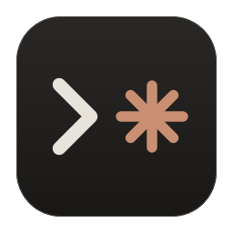
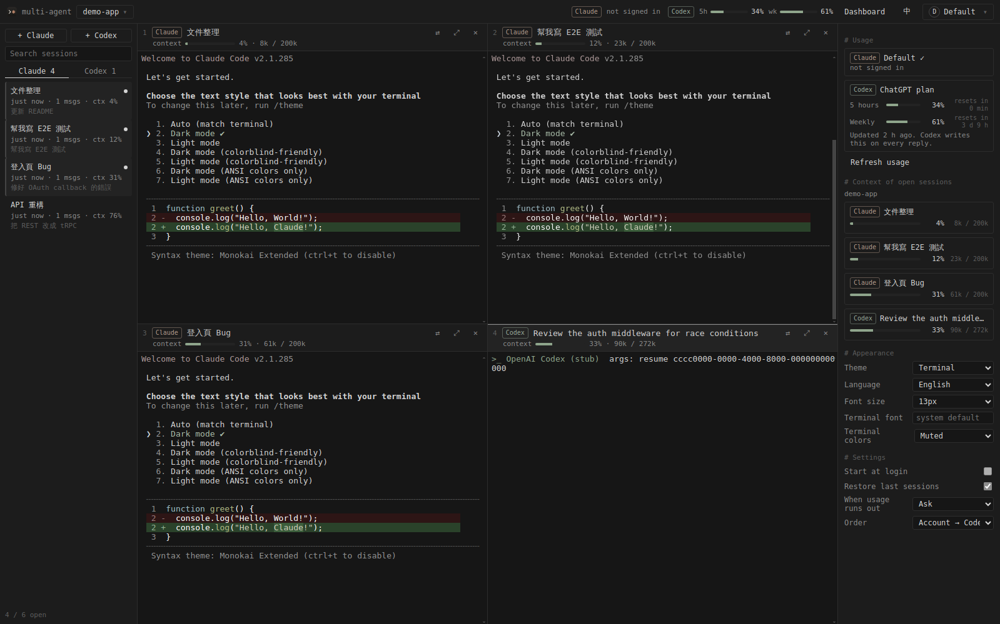
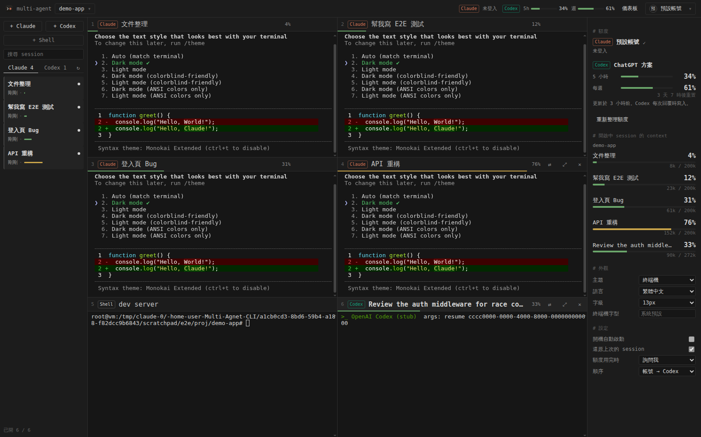
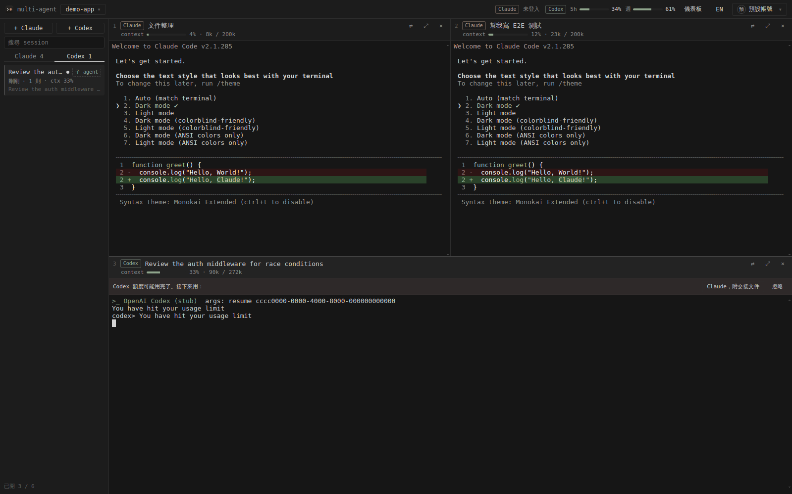

<p align="center"></p>

<h1 align="center">Multi-Agent CLI</h1>

<p align="center">繁體中文 · <a href="README.en.md">English</a></p>

同一個專案常常同時開好幾個 Claude Code session。每次開機都要開一堆終端機、`cd` 進去、再一個個 `--resume`。這個桌面程式把它們收進同一個視窗：左邊列出這個資料夾的所有 Claude 與 Codex session，點一下就在右邊開成終端機，最多 6 個並排，關掉程式再打開會原樣還原。



## 功能

- 依專案列出 session 歷史（Claude 與 Codex），可搜尋、改名、右鍵複製 id。
- 每個窗格是真正的終端機（node-pty + xterm.js），跑的就是你平常的 `claude` 和 `codex`。
- 最多 6 格。版面依視窗長寬比自動排，最後一列不滿時會加寬，不會留空格。
- 窗格上方顯示 session 名稱、Claude 或 Codex、使用的帳號，以及 context 用量（例如 `76% · 152k / 200k`）。
- 儀表板顯示每個 Claude 帳號與 Codex 的 5 小時、每週剩餘額度（依剩餘量變色：50% 以上綠、20–50% 黃、20% 以下紅），以及各窗格的 context。
- 多個 Claude 帳號。每個帳號是一個 `CLAUDE_CONFIG_DIR`，session 歷史共用，所以可以換帳號 `--resume` 同一個 session。
- 額度用完時提供接手選項：換另一個 Claude 帳號續跑，或產生交接文件交給 Codex。
- 五種主題（Terminal、Graphite、Sand、Mono、Paper），整個介面使用系統終端機的等寬字型。Claude 與 Codex 標籤用它們原本的品牌色。
- 英文與繁體中文介面，在儀表板的「外觀」切換。



## 安裝

需要 Node.js 22.12 以上，以及能在終端機執行並已登入的 `claude`。要用 Codex 的話另外需要 `codex`。

```bash
git clone https://github.com/Nelson0314/Multi_Agnet_CLI.git
cd Multi_Agnet_CLI
npm install
```

`npm install` 完成後，桌面會多一個 Multi-Agent CLI 捷徑：

| 系統 | 捷徑 |
| --- | --- |
| Windows | `桌面\Multi-Agent CLI.lnk` |
| macOS | `~/Desktop/Multi-Agent CLI.app` |
| Linux | `~/Desktop/multi-agent-cli.desktop`，也會加進應用程式選單 |

之後雙擊捷徑就能開。安裝時如果顯示「找不到桌面資料夾」而沒有建立捷徑，或是捷徑刪掉了，可以用 `npm run shortcut` 重建；不想要捷徑的話，安裝時設定 `MULTI_AGENT_NO_SHORTCUT=1`。也可以直接在專案資料夾執行 `npm start`。

更新：

```bash
cd Multi_Agnet_CLI
git pull
npm install
```

平台差異：

- macOS 與 Windows 使用 node-pty 內附的預編譯模組，不需要編譯工具。
- Linux 需要 `build-essential` 與 `python3`，`npm install` 會自動編譯 node-pty。
- 程式透過你的 login shell 找 `claude` 和 `codex`，所以用 nvm、Homebrew 或 npm 全域安裝的都找得到。

## 使用

| 動作 | 方式 |
| --- | --- |
| 開專案 | 左上角的專案按鈕 |
| 開舊 session | 點左側清單。已開的會聚焦到該窗格。`↻` 重新讀取 session 歷史 |
| 新 session | `+ Claude` 或 `+ Codex`，可以先取名 |
| 純終端機 | `+ PowerShell`（macOS、Linux 顯示為 `+ Shell`），在專案資料夾開一個一般的終端機。Windows 有裝 PowerShell 7 就用 `pwsh`，否則用內建的 Windows PowerShell。會跟著版面一起還原，也使用目前帳號的設定，所以在裡面打 `claude` 會用同一個帳號 |
| 改名 | 雙擊窗格標題，或在清單上按右鍵 |
| 最大化 | 窗格右上 `⤢` |
| 切換窗格 | `Ctrl/⌘ + 1…6` |
| 側欄 | 預設收成一條細邊，只留一個 `›`；滑鼠移上去會浮出完整側欄。按 `‹` `›` 或 `Ctrl/⌘ + B` 固定展開或收起 |
| 複製、貼上 | macOS 用 `⌘C` `⌘V`；Windows、Linux 用 `Ctrl+Shift+C` `Ctrl+Shift+V`。`Ctrl+V` 留給 Claude Code 貼圖片 |
| 換帳號續跑、交給 Codex 或 Claude | 窗格右上 `⇄` |
| 登入、新增、切換帳號 | 右上角帳號選單 |
| 主題、字級、字型、語言 | 儀表板的「外觀」 |
| 窗格按鈕 | 滑鼠移到窗格上，或窗格是目前焦點時才會出現 |

關閉窗格只會結束程式，session 紀錄留在硬碟上，隨時可以從清單再開。

## 外觀

儀表板的「外觀」可以選主題、字級與終端機字型。字型預設跟系統終端機一樣：macOS 用 SF Mono 或 Menlo，Windows 用 Cascadia Mono 或 Consolas，Linux 用 DejaVu Sans Mono，中文也用等寬字：Windows 依序找更紗黑體 Sarasa Mono TC、Noto Sans Mono CJK TC、主控台用的細明體，macOS 用蘋方，Linux 用 Noto Sans Mono CJK TC。想指定別的字型，填在「終端機字型」。

主題只改介面的背景、文字和分隔線。窗格裡程式輸出的顏色完全照原樣顯示，16 色 ANSI 色盤沿用系統原生終端機：Windows 是 Windows Terminal 的 Campbell，macOS 是 Terminal.app，Linux 是 GNOME Terminal 的 Tango。

用 Paper 這種淺色主題時，在 Claude Code 裡執行 `/theme` 選 `Auto (match terminal)`。程式會回答 Claude 的背景色查詢，Claude 就會自動用淺色配色。

## 帳號

預設帳號就是你原本的 `~/.claude`，不需要搬任何資料。

新增帳號時，程式會建立一個新的 `CLAUDE_CONFIG_DIR`，並開一個小終端機執行 `claude auth login`。預設勾選「共用 session 歷史」，新帳號的 `projects/`、`settings.json`、`CLAUDE.md`、`commands/`、`agents/`、`skills/` 會以 symlink（Windows 用 junction）指回 `~/.claude`。這樣帳號 A 額度用完時，帳號 B 可以 `claude --resume` 同一個 session，對話內容完整保留。

切換目前帳號只影響之後新開的 session。已經開著的窗格可以從 `⇄` 個別換帳號。

請只加入你自己的帳號，並遵守各服務的使用條款。

## Claude 與 Codex

設計理由寫在 [docs/DESIGN.md](docs/DESIGN.md)。

Codex 當子 agent：帳號選單的「讓 Claude 可以呼叫 Codex」會執行 `claude mcp add --scope user codex -- codex mcp-server`。之後 Claude 可以用 `codex` 開 Codex session、用 `codex-reply` 接著對話。被 Claude 叫出來的 Codex session 會出現在左側 Codex 分頁，標記為「子 agent」，點開就能看它做了什麼，也可以直接接手。

額度用完：窗格輸出出現額度用完的訊息，或額度 API 顯示 5 小時額度達 100% 時，窗格上方會出現選項。



1. 用另一個還有額度的 Claude 帳號 `--resume` 同一個 session。
2. 產生交接文件，在同一格啟動 Codex，要它先讀文件再繼續。
3. Claude 額度恢復後，用同樣的方式從 Codex 交回 Claude。

交接文件寫在專案的 `.multi-agent/handoffs/`，內容包含原始需求、待辦清單、改過的檔案、`git status` 與 `git diff --stat`、最近 12 則對話。這個資料夾會自動加進 `.git/info/exclude`。

儀表板的設定可以選「詢問我」「自動交接」「不處理」，以及先換帳號還是先交給 Codex。

## 窗格之間對話

帳號選單的「讓窗格之間可以對話」會把一個 MCP server 同時裝到 Claude（`claude mcp add`）與 Codex（`~/.codex/config.toml`）。之後開的窗格裡，agent 多了四個工具：

| 工具 | 用途 |
| --- | --- |
| `list_panes` | 列出目前專案的窗格編號、類型、名稱 |
| `send_to_pane` | 把訊息送進另一個窗格的輸入框 |
| `read_pane` | 讀另一個窗格最新的回覆；PowerShell 窗格則讀最後幾行畫面 |
| `wait_for_reply` | 等 Claude 或 Codex 窗格回覆完，再把回覆交回來 |

例如在 Claude 窗格說「請窗格 3 的 Codex review 我剛改的 src/api.ts，等它回覆後整理重點」，Claude 會自己呼叫這些工具，兩邊的對話都在你眼前。

- 訊息開頭會標示來源，例如 `[from pane 2 · Claude · API 重構]`。
- 預設訊息只會放進對方的輸入框，由你按 Enter 才送出，可以在設定的「窗格訊息先確認」關掉。關掉後會等對方畫面安靜 2 秒才送。
- 同一對窗格 10 分鐘內最多傳 12 則，避免兩個 agent 無限互相呼叫。
- 連線只綁本機，token 只給這個程式開的窗格。

## Session 名稱

新增 session 時輸入的名稱，以及之後在程式裡改的名稱，都會寫回 Claude 與 Codex 自己的紀錄，效果跟在裡面打 `/rename` 一樣，所以 `claude -r` 和 `codex resume` 也看得到。Claude 的名稱會在送出第一則訊息、紀錄檔建立之後寫入。

## 資料來源

| 資料 | 來源 |
| --- | --- |
| Claude session 歷史、名稱、context | `~/.claude/projects/<編碼後路徑>/<sessionId>.jsonl`。名稱依序取 `/rename`、自動標題、第一句話 |
| Codex session 歷史、context、額度 | `~/.codex/sessions/YYYY/MM/DD/rollout-*.jsonl` |
| Claude 5 小時、每週額度 | Claude Code `/usage` 使用的 OAuth usage 端點，token 讀自 `.credentials.json` 或 macOS Keychain |
| 帳號 email | `<config dir>/.claude.json` 的 `oauthAccount` |
| 本程式設定與開啟中的窗格 | macOS `~/Library/Application Support/multi-agent-cli/state.json`，Windows `%APPDATA%\multi-agent-cli\state.json`，Linux `~/.config/multi-agent-cli/state.json` |

Context 用量是最後一次主線回覆的 `input + cache_creation + cache_read` tokens 除以 context window。預設 window 是 200k，用量超過或模型標示 1M 時改用 1M。

## 已知限制

- Claude 的額度端點沒有公開文件。格式改變時儀表板會顯示「無法取得額度」，其他功能照常。
- macOS 第一次讀 Keychain 時可能跳出授權視窗，選「永遠允許」。
- Token 過期時額度暫時讀不到，在該帳號開任一個 session 就會更新。
- Codex 的額度來自最近一次 Codex 回覆寫下的紀錄，用過 Codex 之後才有資料。
- 額度用完的偵測靠比對終端機文字。CLI 改了措辭時要更新 `src/main/ptyManager.js` 的 `LIMIT_PATTERNS`。
- Linux 捷徑帶 `--no-sandbox`，因為 npm 安裝的 Electron 沒有設定 setuid 的 `chrome-sandbox`。

- Codex 新版開始把 session 改存成分頁、壓縮的格式（`codex migrate-rollouts --apply` 之後）。目前只讀得到傳統的 `rollout-*.jsonl`，遷移過的 session 不會出現在 Codex 分頁。

## 開發

```bash
npm test          # 單元測試
npm run icons     # 由 assets/icon.svg 重新產生 png、ico、icns
npm run shortcut  # 重建桌面捷徑
```

```
assets/              圖示（icon.svg 是來源）
scripts/             postinstall、捷徑、圖示產生
src/main/            Electron 主程式：session 讀取、額度、帳號、交接、pty
src/renderer/        介面：app.js、themes.js、i18n.js
test/                node:test 單元測試
```

## 授權

MIT
